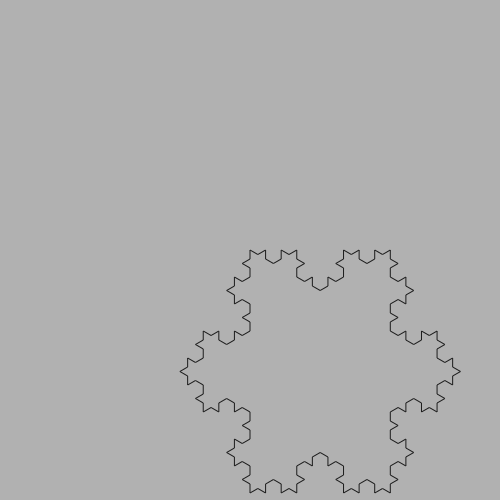

# LOGO

Simple logo language with a minimal set of statements.

Uses node-canvas to draw png files, but can be used in a web page as well, with some minor tweaks.

## statements

  * TO
  * SHOW
  * MAKE
  * REPEAT
  * IF
  * PENDOWN, PD
  * PENUP, PU
  * FORWARD, FD
  * BACKWARD, BK

## features

  * supports recursion
  * arguments to procedures

## run

```
node logo.js script.logo
```

This will generate a `script.png` in the same folder as the script.

## examples

### square

```
TO SQUARE :N
    REPEAT 4 [ FORWARD :N RIGHT 90 ]
END
PENDOWN
SQUARE 100
```


### squares

```

TO SQUARE :N
    REPEAT 4 [ FORWARD :N RIGHT 90 ]
END
PENDOWN
REPEAT 10 [
    SQUARE 100
    RIGHT 36
]
PENUP
```


### triangle

```
PENUP

LEFT 90
FORWARD 200
LEFT 90
FORWARD 200
RIGHT 180

MAKE "L 400
MAKE "D 10

LEFT 90
REPEAT 10 [
    PENDOWN
    REPEAT 3 [
        RIGHT 120
        FORWARD :L
    ]
    PENUP
    RIGHT 180
    FORWARD :D
    LEFT 180
    MAKE "L :L - :D * 2
]    

```


### pattern

```
PENDOWN
REPEAT 4 [
	REPEAT 3 [FORWARD 50 RIGHT 120]
	REPEAT 4 [FORWARD 70 RIGHT  90]
	REPEAT 5 [FORWARD 80 RIGHT  72]
	LEFT 90
]
```


### snowflake

```
; test
TO SQUARE :SIZE :DEPTH
    IF :DEPTH = 0 [ STOP ]
    REPEAT 4 [
        FORWARD :SIZE
        RIGHT 90
        SQUARE ( :SIZE * 0.4 ) ( :DEPTH - 1)
    ]    
END
PENDOWN
SQUARE 200 3
```


### spiral

```
 TO SPIRAL :N
    IF :N < 1 [ STOP ]
    FORWARD :N
    RIGHT 20
    SPIRAL :N * 0.97
 END
 PENDOWN
 SPIRAL 50
```


### koch

```
TO LINE :COUNT :LENGTH
 IF :COUNT = 1 [
    FD :LENGTH
    STOP
 ] 
 LINE :COUNT - 1 :LENGTH
 LT 60
 LINE :COUNT - 1 :LENGTH
 RT 120
 LINE :COUNT - 1 :LENGTH
 LT 60
 LINE :COUNT - 1 :LENGTH
END

TO KOCH :COUNT :LENGTH
  RT 30
  LINE :COUNT :LENGTH
  RT 120
  LINE :COUNT :LENGTH
  RT 120
  LINE :COUNT :LENGTH
END

PD
KOCH 4 9
```



## Copyright

(c) 2024 Johan Van den Brande

```
(\/)
( ..)
C(")(")
```